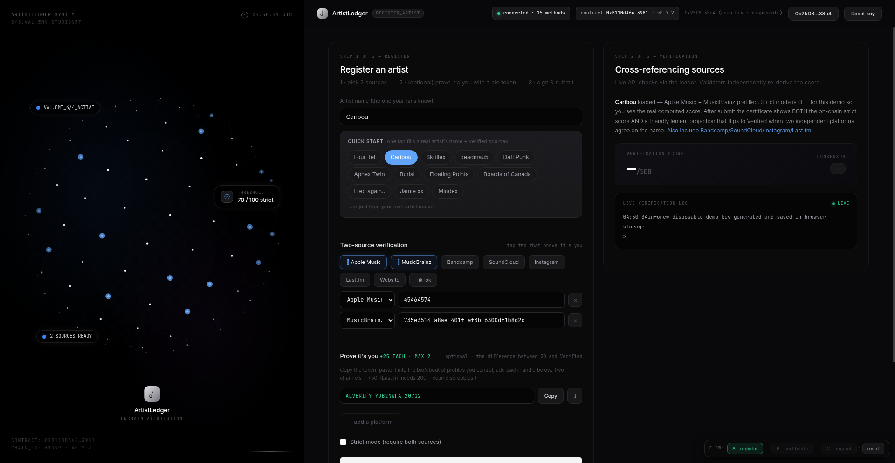

<p align="center">
  
</p>

<h1 align="center">ArtistLedger</h1>

<p align="center">
  <b>On-chain proof that a music artist is real.</b><br/>
  A GenLayer Intelligent Contract that adjudicates music-provenance claims
  against 8 free public APIs — no oracle, no trust-me, no paid keys.
</p>

<p align="center">
  <a href="https://artistledger-frontend.vercel.app/"></a>
  <a href="https://explorer-studio.genlayer.com/address/0xB110dA64B1c14B65c078430fd6Bd0f9E79d83981"></a>
  <a href="https://github.com/interfluve-wav/ArtistLedger/actions"></a>
  
</p>

---

## The problem

Anyone can claim to be Caribou today. Music provenance has no neutral
arbiter — streaming platforms don't verify identity, bios are self-written,
and there's no on-chain record of *who actually is* an artist.

## The answer

ArtistLedger is an **Intelligent Contract** on GenLayer (studionet) that
reads **8 free public APIs** and adjudicates the claim on-chain:

| Source | What it proves |
|---|---|
| Apple Music | canonical artist ID + name agreement |
| Spotify | artist profile exists under that name |
| MusicBrainz | MBID + release catalog |
| Bandcamp | artist page + releases |
| SoundCloud | handle + profile |
| Instagram | handle + profile |
| Last.fm | artist page |
| Etherscan | the claiming wallet's own on-chain footprint |

**The flow.** The leader runs the API checks plus an LLM press-narrative
judge; validators deterministically re-derive the score from the evidence
(no live re-fetch — consensus can't drift on rate limits). The verdict
lands as a **VRFD certificate** with an honest dual score: the strict
on-chain score *and* a lenient projection, side by side. Nothing faked.

**Proof tokens (ALVERIFY).** Paste a token into the artist's own bio —
it becomes the strongest signal (+25 each). The token is derived from the
artist name + wallet, so it can't be replayed for another identity.

**Identity rotation.** Lost key? `reverify` moves a verified identity to a
new wallet by re-proving the same profiles. Keys are revocable; the
profile cluster is the identity.

## Live demo

**https://artistledger-frontend.vercel.app**

1. Open the site — a connect popup appears. Tap **Disposable Testnet Key**.
2. Tap any artist chip — name + two verified sources auto-fill.
3. **Sign & submit proof** → watch validators re-derive the score →
   green **VRFD** certificate → **Inspect** for full evidence + calldata.

Contract: `0xB110dA64B1c14B65c078430fd6Bd0f9E79d83981` (studionet, chainId 61999)
Explorer: https://explorer-studio.genlayer.com/address/0xB110dA64B1c14B65c078430fd6Bd0f9E79d83981

## Architecture

```
┌──────────────┐   register_artist   ┌───────────────────────────────┐
│  Web app     │ ───────────────────▶│  ProvenanceRegistry (GENVM)   │
│  (static,    │                     │  · leader collects evidence   │
│   Vercel)    │ ◀───────────────────│  · validators audit (determ.) │
└──────────────┘   certificate +     │  · consensus → VRFD / flags   │
                   evidence JSON     └───────────────┬───────────────┘
                                                     │ reads
        ┌──────────────┬──────────────┬──────────────┼──────────────┐
        ▼              ▼              ▼              ▼              ▼
   Apple Music     Spotify      MusicBrainz     Bandcamp      SoundCloud
        Instagram    Last.fm      Etherscan (wallet footprint)
```

## Repo layout

```
contracts/ProvenanceRegistry.py   the Intelligent Contract (GENVM Python)
frontend/                         the web app (vanilla JS, zero build step)
tests/                            174 tests: scoring, validators, reverify
examples/                         API lookup + smoke-test scripts
scripts/ci_local.sh               run the whole local gate (lint + tests)
```

## Run it yourself

```bash
# contract tests
python3 -m venv .venv && source .venv/bin/activate
pip install -e .
pytest -q          # 174 passed

# frontend (any static server works — it talks to the RPC directly)
cd frontend && python3 -m http.server 8000
# open http://localhost:8000
```

See [docs/QUICKSTART.md](docs/QUICKSTART.md) for the full local run,
deploy, and on-chain verification walkthrough.

## Why GenLayer

Bitcoin solved *trustless money*. Ethereum solved *trustless computation*.
GenLayer solves **trustless adjudication** — the contract doesn't just
execute; it reasons about real-world evidence and settles the claim.

## License

MIT — see [LICENSE](LICENSE).
